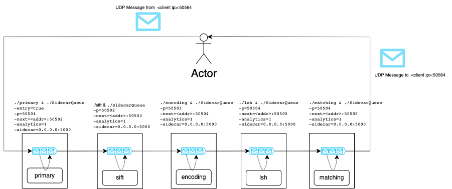

# Sidecar Queue 

## Use the container

To use the container create your dockerfile with 

```
FROM ghcr.io/giobart/active-internal-queue/active-sidecar-queue:latest
```

You'll find the SidecareQueue binary in `/home/SidecarQueue

Example:
```
FROM ghcr.io/giobart/active-internal-queue/active-sidecar-queue:latest

ADD ./bin/ home/

CMD ["/bin/bash","-c","/home/<MySidecarApplication> & /home/SidecarQueue -entry=true -exit=true -p=50001"]
```

In this example we launched a Sidecar application in background together with the SidecarQueue. 

## A multi container example



In this picture we see an example using a client application and a pipeline composed of 5 containers. Each container will run the sidecar queue and a sidecar microservice.

* The microservice names are: primary, sift, encoding, lsh and matching.
* The sidecar microservice will always use the port 5000 internally as an assumption and will implement the gRPC SERVER as the spec defined [here](https://github.com/giobart/Active-Internal-Queue/tree/main/pkg/gRPCspec)
* You can see in the picture the startup command of each container 

## Startup flags

```
-analytics float
        How often the analytics service will gather the information. The value refers to How many seconds to wait between one query and another. 
  -entry
        If True, this is an entrypoint, and frames will be received from the UDP socket
  -exit
        If True, this is an exitpoint, no next service will be used, but frames will be sent back to the client using the client address
  -ms int
        Threshold in milliseconds, number of milliseconds after which a frame is considered obsolete and is discarded (default 200)
  -next string
        Address of the next service in the pipeline (default "localhost:50555")
  -p string
        port that will be exposed to receive the frames (default "50506")
  -sidecar string
        address of the sidecar service (default "localhost:50505")

```

## Run

`go run sidecarQueue.go`

## Build

`go build -o bin/SidecarQueue sidecarQueue.go`


